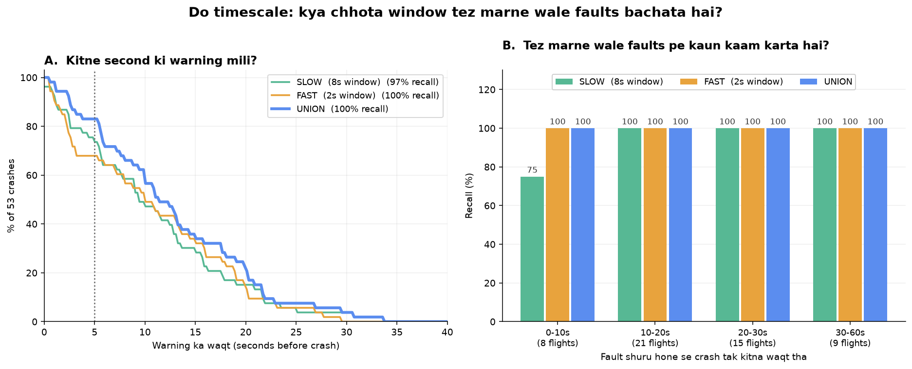
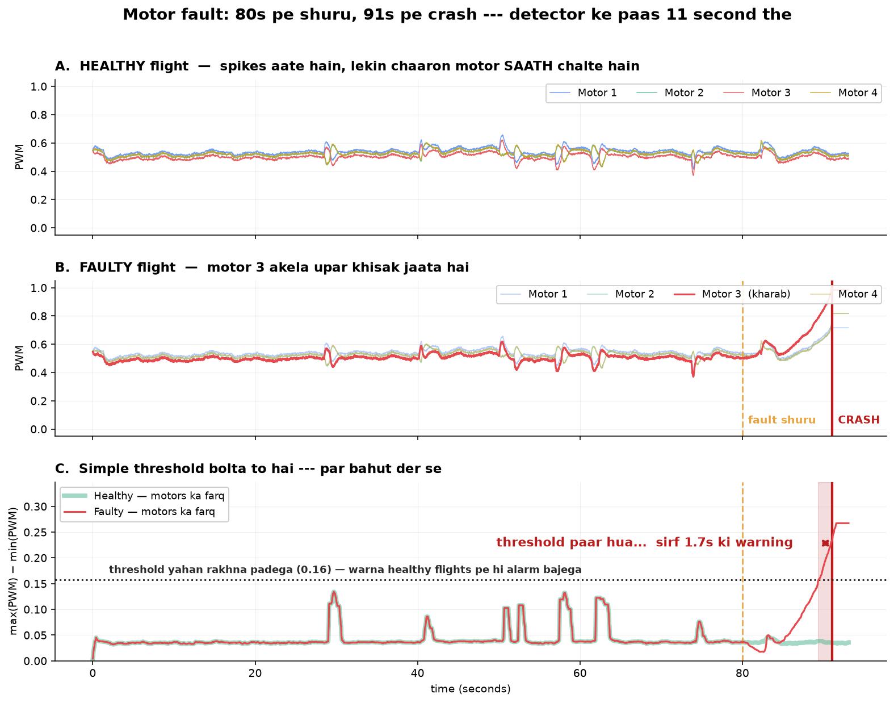
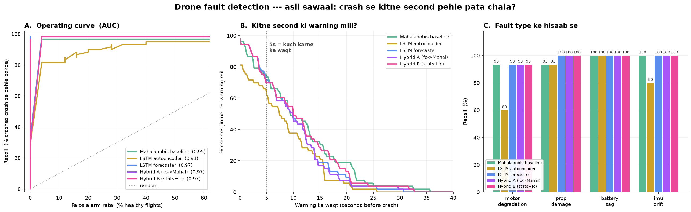
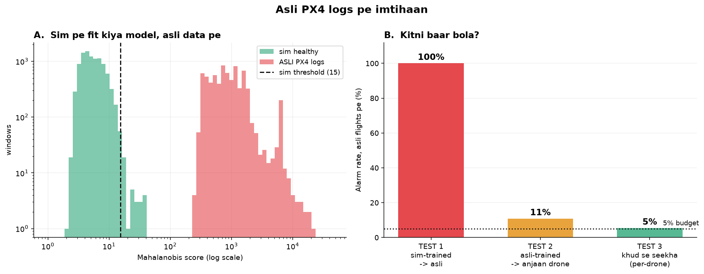
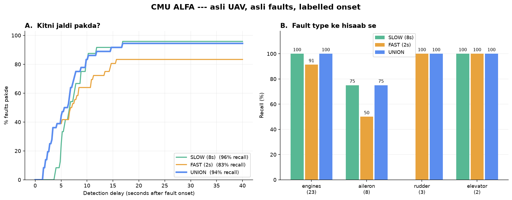

# Drone Flight Safety Monitor

> Drone ke telemetry se **crash hone se pehle** motor / battery / sensor failure pakadna.

<p align="center">
  
  
  
  
  
</p>

Ek drone girne se pehle chillata hai — motor ka current badhta hai, vibration ka
pattern badalta hai, ek motor baaki teeno se zyada khinchta hai. Insaan ye 50 Hz
ke 19 channels me nahi dekh sakta. Model dekh sakta hai.

<p align="center">
  
  <br>
  <sub><b>Best system:</b> do Mahalanobis detectors, do timescale pe (8s + 2s), dono ka OR.
  Ek bhi neural network nahi.</sub>
</p>

---

## TL;DR --- asli sawaal aur asli jawab

Sawaal: **drone girne se kitne second pehle pata chal jaata hai?**

Test set me 60 me se **53 faulty flights sach me crash hui**. Fault shuru hone se
crash tak average 20 second the. Sabse accha system --- **do Mahalanobis detectors,
do alag timescale pe** (8s window + 2s window, dono ka OR):

```
  100% crashes me alarm crash SE PEHLE baja
  median warning  : 11.4 seconds
  kharab 25% ko   :  5.8 seconds
  83% crashes ko 5+ second mile, 60% ko 10+ second
```

Tulna ke liye: **naive PWM-threshold ne 1.7 second di thi.** Aur is poore system
me **ek bhi neural network nahi hai.**

### Aath cheezein jo seekhne ko mili

1. **Purani statistics abhi bhi barabar khadi hai.** Mahalanobis detector --- koi
   neural network nahi, bas window ka mean/std aur covariance --- **74%** crashes
   me 5+ second ki warning deta hai. Sabse accha neural model **72%**. LSTM
   forecaster ek flight zyada pakadta hai (98% vs 96%), par **kharab cases me kam
   waqt deta hai** (p25 4.7s vs 5.5s). Safety me worst case maayne rakhta hai,
   isliye ye jeet nahi hai.

2. **Autoencoder is kaam ke liye galat aujaar hai.** Usse input *dobara banana*
   hota hai --- jawab uske saamne rakha hota hai, wo bas copy kar deta hai. 81%
   recall, 12% false alarm: sabse kharab. Wahi model jab agla pal *predict* karne
   laga to 98% / 0% ho gaya. Architecture ka farq, training ka nahi.

3. **Naapna theek karna, model badalne se zyada zaroori hai.** Do baar ye saabit
   hua: validation set 25 se 100 flights karne se recall 45% -> 77% ho gayi (code
   me ek line badle bina), aur ek denominator ki galti "sirf aasan cases pakadne
   wale" detector ko best dikha rahi thi.

4. **Median dhoka deta hai.** 10 second sunne me achha lagta hai, par p25 sirf
   5.5s hai aur ek flight ko 0.7s mile. Agar ye asli product hota to worst case
   pe design karna padta.

5. **Aur ek claim jo maine kiya aur galat nikla:** maine likha tha ki `imu_drift`
   telemetry se pakda hi nahi ja sakta. Ab wo **100% recall, 17.5s median lead**
   pe hai. Wo undetectable nahi tha --- **maine use itna halka banaya tha ki
   pakadne layak kuch tha hi nahi.**

6. **Sabse bada sudhaar model se nahi, DESIGN se aaya.** 8s window ka matlab tha
   ~10-12 second ka minimum reaction time --- yani jo fault 10 second se kam me
   maarta hai wo pakda ja hi nahi sakta tha, chahe model kitna bhi accha ho.
   Saath me ek 2s-window detector chalane se recall 97% -> 100% aur 5+ second
   warning 74% -> 83% ho gayi. Dono milakar wahi 5% false alarm budget me.

7. **Asli PX4 logs pe: model transfer nahi hota, tareeka hota hai.** Mere
   simulator pe fit kiya model 37 asli flights me se **100%** pe alarm bajata
   hai (score distributions overlap tak nahi karte). Lekin wahi *tareeka* asli
   data pe fit karke **10.8%**, aur har drone ko apne pehle 60s se calibrate
   karne pe **5.4%** --- lagbhag target pe. **Ek model sab drones ke liye nahi
   ship kar sakte.**

   Par dhyan raho: asli logs me ground truth nahi hota, isliye wahan sirf
   "chup rehna" naapa gaya. **Asli hardware pe ye abhi bhi saabit nahi hua ki
   detector ek asli marta hua motor pakdega.**

8. **Aur aakhir me --- haan, ye asli hardware pe asli fault pakadta hai.**
   CMU ALFA dataset (asli UAV, asli in-flight failures, **labelled onset**) pe:
   **94% recall, 5.3 second median detection delay, 9.3% false alarm.**

   Par imaandari se: ALFA **fixed-wing** hai, quadcopter nahi. Ye *tareeke* ko
   validate karta hai, mere quad detector ko nahi.

Agar ek line me: **pehle naapna theek karo, phir design, phir model.**

---

## Asli problem kya hai

Sabse pehle jo baat samajhni zaroori hai:

```
Motor 1: 0.52    Motor 2: 0.51    Motor 3: 0.58    Motor 4: 0.51
```

Motor 3 ka `0.58` **akela dekho toh normal hai** — tez chadhte waqt saare motors
0.70 tak jaate hain. Galat cheez kisi *ek* number me nahi hai. Wo **numbers ke
aapsi rishte** me hai: motor 3 baaki teeno se 13% zyada mehnat kar raha hai,
jabki drone seedha hover kar raha hai.

Aur yahi cheez simple threshold ko bekaar bana deti hai. Hamare data me:

| | Healthy | Faulty (fault ke baad) |
|---|---|---|
| Motors ka farq, median | `0.036` | `0.110` |
| Motors ka farq, **tez turn** ke waqt (p99) | `0.158` | `0.208` |

Healthy drone bhi turn lete waqt `0.158` tak jaata hai. False alarm se bachne ke
liye threshold wahin rakhna padega — aur phir ye hota hai:

```
fault shuru                     : 80.0 s
naive feature ne threshold paar : 89.4 s
CRASH                           : 91.1 s

>> sirf 1.7 second ki warning
```

**Ye "detect nahi kar paaya" ka problem nahi hai. Ye "itni der se bataya ki koi
fayda nahi" ka problem hai.** 1.7 second me na pilot kuch kar sakta hai, na
autopilot. Isiliye is project ka asli metric recall nahi, **lead time** hai.

> Aur jo sawaal sulajhana hai wo ye hai: *"Motors ka tedhapan isliye hai ki pilot
> ne turn maanga, ya isliye ki motor mar raha hai?"* — iske liye **context**
> samajhna padta hai, aur wahi cheez warning ko 2 second se badha kar kaam ke
> layak bana sakti hai.



---

## Data kahan se aaya

Apna quadcopter simulator likha (`src/simulator.py`) — physics + PID autopilot,
50 Hz pe 19 channels.

**Simulator kyun, asli data kyun nahi:** asli PX4 logs me ye **pata hi nahi hota
ki failure exactly kab shuru hua**. Bina us ground truth ke, "kitne second pehle
pakda" naapa hi nahi ja sakta. Simulator me hum fault khud daalte hain, toh
second-by-second sach pata hota hai.

Design ki sabse zaroori baat — **autopilot ko nahi pata ki motor kharab hai:**

```python
pwm = np.sqrt(T_des / T_MAX)   # controller maanta hai saare motor theek hain
T_act = T_MAX * pwm**2 * motor_eff * health * v_factor   # asli duniya alag hai
```

Controller sirf itna dekhta hai ki drone jhuk raha hai, aur us motor ko zyada zor
se chalata hai. **Fault ka nishaan apne aap ubharta hai** — humein usko haath se
"banana" nahi padta.

### "Normal" ko boring mat banao

Ye sabse badi trap hai. Pehle version me healthy flight ka PWM 90 second tak
`0.49` pe seedhi line thi. Aise data pe koi bhi model 99% accuracy de dega aur
asli log pe mooh ke bal girega.

Isliye healthy drone me bhi wo sab daala gaya jo asli duniya me hota hai:

- **Motor manufacturing variation (±3%)** — do motor kabhi ek jaise nahi bante
- **Off-center payload** — drone hamesha halka sa ek taraf jhuka rehta hai
- Gusty wind, lagatar halki maneuvering, alag alag pilot styles, battery drain

Pehli do khaas hain: wo **healthy drone me bhi permanent asymmetry** banati hain.
Yani model ko *presence* se nahi, *degree* se farq karna padega.

### Fault ab rukta nahi — drone sach me girta hai

Pehle version me fault ek had pe jaakar sthir ho jaata tha (motor ka health
0.65 pe atak jaata). Wo galat tha: **asli duniya me marta hua motor sthir nahi
hota, wo marta rehta hai.** Aur us version me "lead time" naapa hi nahi ja sakta
tha, kyunki koi crash hi nahi hota tha.

Ab degradation ki koi had nahi. Drone do tareeke se marta hai:

| | Kab |
|---|---|
| **Palat gaya** | tilt 60° paar — controller wapas seedha nahi kar sakta |
| **Zameen se takraya** | thrust weight se kam pad gaya, 1.5 m/s se zyada tezi se utra |

Har fault type ab sach me maarta hai. `ramp_s` tay karta hai kitni jaldi
(`src/probe_crash.py` se naapa gaya):

```
ramp 10s  ->  drone ~5-29s me gir jaata hai    (achanak wali failure)
ramp 60s  ->  drone ~26-56s me girta hai       (dheere marta motor)
```

**Aur sabse zaroori niyam:** crash ke baad ki telemetry **ginti me nahi aati.**
Wahan drone palat raha hai — har channel pagal dikhta hai, aur koi bhi detector
use pakad lega. Us par credit lena apne aap ko dhoka dena hai (aur recall ko
jhoothe taur pe 90%+ dikha dega). Evaluation me sirf wo alarm gina jaata hai jo
**crash se pehle** baja.

#### Do bug jo yahan pakde gaye

Crash detection lagate hi pata chala ki **40 me se 7 healthy flights bhi gir
rahi thi** — wo bilkul galat hai. Do asli wajah nikli, dono ab theek hain:

1. **Yaw setpoint ek jhatke me π radian ghoom jaata tha.** Yaw PID itna torque
   maangta tha ki mixer chaaron motors ko `0 / 1 / 0 / 1` pe pel deta — aur
   roll/pitch ka control hi khatam ho jaata. Ab heading 70°/s se hi ghoomta hai.

2. **Mixer saturate hone pe yaw ki priority sabse kam honi chahiye.** Roll/pitch
   ka control khona = crash; yaw ka control khona = drone bas ghoom jayega.
   Ab saturation pe pehle yaw authority kaati jaati hai — PX4 aur ArduPilot
   dono yahi karte hain.

### Splits

```
train   : 100 healthy flights     <- model sirf isi pe seekhta hai
val     : 100 healthy flights     <- threshold tay karne ke liye
test    :  25 healthy + 60 faulty (4 fault type x 15)
```

**Faulty flights train me bilkul nahi hain.** Model sirf "normal" ka matlab
seekhta hai, phir jo bhi normal se hatt ke ho wo pakadta hai — isse wo fault bhi
pakde jaate hain jo humne kabhi sikhaye hi nahi.

---

## Chaar fault, chaar alag zubaan

Har fault ka apna nishaan hai. Ye har flight ko **apne hi** pehle ke hisse se
compare karke nikala gaya hai (`src/check_dataset.py`), taaki drone-to-drone
variation cancel ho jaye:

| Fault | Uska asli tell |
|---|---|
| `motor_degradation` | pwm spread **+113%**, gyro +79%, vibration +43% |
| `prop_damage` | vibration **+696%**, pwm spread +436% |
| `battery_sag` | voltage **-22%**, current +64%, pwm mean +32% |
| `imu_drift` | gyro **+673%** — aur baaki sab ~10% |

Char alag channels, char alag kahaniyan. **Koi ek hand-crafted feature chaaron
ko nahi pakad sakta** — aur yahi wajah hai ki "sirf PWM spread dekho" wala naive
detector kaam nahi karta:

```
naive detector (sirf PWM spread), 5% false alarm pe:
  motor_degradation  100%
  prop_damage        100%
  battery_sag         40%
  imu_drift            7%     <- gyro me bolta hai, PWM me nahi
  ------------------------
  kul                 62%
```

Par asli problem uski recall nahi hai. Upar wala plot dekho: wo threshold ko
**crash se sirf 1.7 second pehle** paar karta hai. Pakadta hai, par itni der se
ki koi fayda nahi.

---

## Paanch approach

| | Kya karta hai |
|---|---|
| **Mahalanobis baseline** | 8s window ke mean+std (38 features) → covariance se distance. **Koi neural network nahi.** |
| **LSTM autoencoder** | 8s clip ko 24 numbers me nichodo, wapas banao. Reconstruction error = score. |
| **LSTM forecaster** | Pichhle 8s se agla 1s **predict** karo. Prediction error = score. |
| **Hybrid A** | Forecaster ke errors, phir unpe Mahalanobis. |
| **Hybrid B** | Window stats + forecaster errors, dono ek saath → Mahalanobis. |

Sab ek hi paimane pe: wahi 8s window, wahi 2s stride, wahi threshold logic
(`src/common.py`), wahi "3 lagatar windows" wala alarm rule.

### Autoencoder se forecaster kyun

Autoencoder ko input **dobara banana** hai — yani **jawab uske saamne rakha hai**.
Voltage 14.2 dikha, voltage 14.2 likh diya. Copy. Wo kabhi ye poochta hi nahi ki
*"kya 14.2 normal hai?"*

Forecaster se jawab chheen liya jaata hai. Usne physics seekhi hai — *"is load pe
voltage itni raftaar se girta hai"*. Battery sag me voltage 3x tez girta hai →
prediction galat → error. **Wo copy nahi kar sakta, kyunki jo predict karna hai
wo usne dekha hi nahi.**

Isi wajah se `battery_sag` par autoencoder **33%** deta hai aur forecaster **67%** ---
sirf architecture badalne se, wahi data wahi training.

---

## Results

<!-- RESULTS_TABLE -->

Test set me **53 of 60** faulty flights sach me crash hui. Fault shuru hone se crash tak ka waqt: **4–49s** (median 19s) — yani detector ke paas itna hi mauka tha.

Threshold hamesha **validation set** se chuna gaya (100 healthy flights), test se nahi. Aur **crash ke baad ki windows ginti me nahi aati** — palte hue drone ko "detect" karna koi kamaal nahi hai.

### Asli metric: kitne second ki warning mili

| Detector | Warning mili | Median lead | p25 (kharab 25%) | ≥3s | ≥5s | ≥10s | FA |
|---|---|---|---|---|---|---|---|
| **Mahalanobis baseline** | 97% | 10.0s | 5.5s | 79% | 74% | 49% | 0% |
| LSTM autoencoder | 83% | 9.0s | 5.2s | 70% | 64% | 38% | 12% |
| LSTM forecaster | 98% | 10.0s | 4.7s | 87% | 72% | 51% | 0% |
| Hybrid A | 98% | 10.0s | 4.6s | 87% | 70% | 51% | 4% |
| Hybrid B | 98% | 10.3s | 4.6s | 87% | 70% | 55% | 4% |

*Warning mili = kitne % crashes me alarm crash se pehle baja. p25 = kharab 25% cases me kitna waqt mila (ye median se zyada zaroori hai — safety me worst case maayne rakhta hai).*



### Fault type ke hisaab se (recall / median lead time)

| Detector | motor degradation | prop damage | battery sag | imu drift |
|---|---|---|---|---|
| Mahalanobis baseline | 93% / 6.5s | 93% / 9.0s | 100% / 16.0s | 100% / 17.5s |
| LSTM autoencoder | 60% / 5.3s | 93% / 9.0s | 100% / 15.0s | 80% / 11.3s |
| LSTM forecaster | 93% / 5.6s | 100% / 10.0s | 100% / 9.8s | 100% / 14.0s |
| Hybrid A | 93% / 5.6s | 100% / 10.0s | 100% / 8.8s | 100% / 14.0s |
| Hybrid B | 93% / 5.6s | 100% / 10.0s | 100% / 15.0s | 100% / 18.0s |

Tulna ke liye: naive PWM-spread threshold 62% faults pakad leta hai --- par wo crash se sirf **1.7 second** pehle bolta hai. Uski problem recall nahi, **timing** hai. Yahi wajah hai ki is project ka metric lead time hai.

---

## Do timescale --- ek limit jo model se nahi, DESIGN se aayi thi

8-second window wale system me ek chhupi hui limit thi:

```
window fill hone me      :  8 second
3 lagatar windows        : +4 second
------------------------------------
minimum reaction time    : ~10-12 second
```

**Jo fault 10 second se kam me maarta hai, wo is design se pakda ja hi nahi
sakta** --- chahe model kitna bhi accha ho. Dashboard me ye saaf dikhta tha: ek
flight jisme motor 6 second me marr gaya, uspe status aata tha
*"CRASHED (bina warning)"*.

Ilaaj: do detectors saath chalao aur unke alarm ko OR karo.

| | window | stride | reaction time |
|---|---|---|---|
| SLOW | 8s | 2s | ~10s |
| FAST | 2s | 0.5s | ~3s |

### Isme dhoka khane ki ek jagah thi

**Do detectors = do mauke jhootha alarm bajane ke.** Dono ko alag alag 5% pe
set karo to milakar system 8% pe pahunch jaata hai --- aur phir "zyada faults
jaldi pakde" wali jeet asal me false alarms **khareed kar** aayi hogi.

Isliye dono ka threshold ek saath aise chuna jaata hai ki **milakar** wahi 5%
budget rahe. Calibration table isi ko dikhata hai:

```
alpha=0.05   union val FA = 8.0%     <- dono 5% pe = milakar 8%
alpha=0.04   union val FA = 6.0%
alpha=0.03   union val FA = 4.0%     <- chuna gaya
```

### Nateeja

| | recall | median lead | p25 | ≥5s | ≥10s | test FA |
|---|---|---|---|---|---|---|
| SLOW akela | 97% | 10.0s | 5.5s | 74% | 49% | 0% |
| FAST akela | 100% | 10.0s | 2.7s | 68% | 51% | 4% |
| **SLOW + FAST** | **100%** | **11.4s** | **5.8s** | **83%** | **60%** | 4% |

Dhyan do: **FAST akela SLOW se kharab hai** (p25 2.7s vs 5.5s) --- wo zyada
pakadta hai par ghatiya warning deta hai. Lekin dono milkar dono se behtar hain,
kyunki wo alag alag cheezein pakadte hain.


**Panel B hi asli jawab hai:** jo faults 0-10 second me maarte hain, un par
SLOW 75% deta hai aur FAST 100%. Baaki saare bins me teeno 100% pe hain. Yani
FAST ka poora yogdan wahi hai jahan wo hona chahiye tha --- aur kahin nahi.

### Kya ye jeet false alarms se khareedi gayi? Nahi.

Union ka test false alarm 4% hai, SLOW-alone ka 0% --- 25 me se 1 flight ka
farq. Isliye alpha ko poori range me ghumakar dekha gaya:

```
   alpha   test FA   recall     p25    >=5s   >=10s
  0.0300        4%     100%    5.8s     83%     60%   <- chuna gaya
  0.0150        0%     100%    5.8s     83%     58%   <- 0% FA pe BHI
  0.0100        0%     100%    5.8s     83%     58%
  ---
  SLOW akela    0%      97%    5.5s     74%     49%
```

alpha 0.01 se 0.03 tak ek poora **plateau** hai jahan union har metric pe aage
hai --- 0% false alarm pe bhi. Jeet asli hai.

(0.0075 se neeche ek cliff hai jahan recall 100% se 75% gir jaati hai. Yani
calibration ke liye plateau kaafi chauda hai, par anant nahi.)

---

## Asli PX4 logs pe imtihaan

`logs.px4.io` se **86 public quadrotor logs** download kiye, jinme se **37 kaam
ke nikle** (2.2 GB). Sab asli hardware --- 23 alag drones, 4S (15V) chhote quads
se lekar 22S (83V) industrial machines tak, current 8A se 200A.

### Pehle: kya naapa JA SAKTA hai

**Asli logs me ground truth nahi hota.** Kisi PX4 log me ye likha nahi hota ki
"motor 3 ka fault 47.2s pe shuru hua". Iska seedha matlab:

> **Lead time aur recall asli data pe naapa hi nahi ja sakta.**
> Sirf ye naapa ja sakta hai ki **detector kitni baar bolta hai.**

Aur ek baat jo bhoolni nahi chahiye: **log log KYUN karte hain? Aksar isliye ki
kuch gadbad hui.** Flight Review ek debugging tool hai. Toh in flights ko
"healthy" maan lena galat hai --- isliye main ise "false alarm rate" nahi,
**"alarm rate"** kehta hoon.

### Teen tests

| | Sawaal | Alarm rate |
|---|---|---|
| **1. Transfer** | Mere simulator pe fit kiya model asli log pe chalega? | **100%** |
| **2. Cross-vehicle** | Asli logs pe fit karke ANJAAN drone pe? | **10.8%** |
| **3. Per-drone** | Har drone apne hi pehle 60s se seekhe? | **5.4%** |



### Test 1: model transfer nahi hota. Bilkul nahi.

Panel A me dono distributions **overlap hi nahi karte**. Sim healthy scores
2–40, asli scores 250–20,000 --- asli data ka median score **157x** zyada.
Har ek flight pe alarm baja.

Wajah diagnostic me saaf hai --- **19 me se 11 channels** ka asli median mere
simulator ke 5–95% band se bahar hai:

```
channel     SIM median   REAL median
accel_z          0.000       -9.800    <-- ye distribution shift NAHI hai
alt              3.481        7.847        --- ye DEFINITION mismatch hai
voltage         15.893       23.203
current          9.637       18.963
vibe_x           0.470        4.091
pwm_1..4          0.51         0.77
```

`accel_z` sabse saaf galti hai: **mere simulator me accel world-frame net
acceleration hai (gravity ghata hua), PX4 me body-frame specific force hai
(gravity shamil).** Ye do alag raashi hain, ek hi naam se. Baaki channels asli
variation hain: asli drones 4S se 22S tak hain, mera ek hi 4S design.

### Test 2 aur 3: *tareeka* transfer hota hai

Model nahi, par **method** chalta hai. Asli logs pe hi fit karke anjaan drones
pe: **10.8%** alarm rate (5% target ka do guna). Aur har drone ko apne hi pehle
60 second se calibrate karne pe: **5.4%** --- lagbhag theek target pe.

> **Practical nateeja: ek model sab drones ke liye nahi ship kar sakte.
> Har drone pe calibrate karna padega.** Asli predictive-maintenance systems
> bhi yahi karte hain.

(Dono tests **leave-one-vehicle-out** hain --- baari baari har vehicle hata kar
baaki pe train, hataye hue pe test. Pehle maine ek random split liya tha jisme
test me sirf 7 flights thi; us par koi number kehna bemani tha.)

### Jo is test se SAABIT NAHI hua

**Ye test sirf aadha sawaal poochta hai.** Detector ke do kaam hain:

| | asli data pe naapa? |
|---|---|
| healthy flights pe chup rehna | **haan** --- 5.4% |
| asli faults pakadna | **nahi** --- ground truth hi nahi hai |

Yani asli hardware pe ye **abhi tak saabit nahi hua ki detector ek asli marta
hua motor pakdega.** Wo sirf simulator me dikha hai. Ye is poore project ki
sabse badi baaki hui cheez hai.

### Data quality --- jo raaste me mila

Public log database se seedha "asli data" utha lena kaam nahi karta:

```
1200 logs index me
  -92  PX4_SITL (simulation, asli drone nahi)
  ...  quadrotor + 3-20 min filter -> 135 candidates
   86  download kiye
  -31  udi hi nahi (arm nahi hua / altitude nahi badli / current ~0)
  -16  DUPLICATE (wahi flight, naya UUID)
   -4  sensor values bakwaas (ek log me accel_x = 2.2e20)
  ----
   37  kaam ke
```

Duplicate wali baat sabse khatarnak thi: bina dedup ke **wahi flight train aur
test dono me** chali jaati, aur "anjaan drone pe generalize kiya" wala result
asal me apne hi training data pe test karna hota.

---

## CMU ALFA --- asli hardware, asli fault, LABELLED onset

Ye dataset project ka aakhri khula sawaal band karta hai. 47 autonomous flights
ek Carbon-Z T-28 UAV ki, jinme **fault ka waqt labelled hai** (CC BY 4.0,
272 MB processed subset).

### Pehle: ye kya test hai aur kya NAHI

**ALFA fixed-wing hai, quadcopter nahi.** Ek engine, aur aileron/elevator/rudder.
`pwm_1..4` jaisa kuch hai hi nahi. Toh ye "mera quad detector asli quads pe" ka
test **nahi** hai --- ye **"kya ye TAREEKA asli labelled faults pakadta hai"**
ka test hai.

Aur data mere simulator se bahut dheema hai:

```
mera simulator   : 50 Hz
ALFA raw IMU     : 10 Hz
ALFA rc-out      :  2.9 Hz     <-- actuator outputs, 17x dheema
```

50 Hz pe resample karna jhooth hota (wo interpolation hai, information nahi),
isliye poora kaam **10 Hz** pe hua, 15 channels ke saath.

### Setup

Wahi design jo PX4 pe kaam kiya tha --- **per-flight self-calibration**:
har flight apne hi pre-fault hisse se seekhta hai (onset se 5s pehle tak),
phir wahi detector baaki flight pe chalta hai. Threshold **leave-one-flight-out**
aata hai --- us flight ka apna data kabhi nahi.

Fault ke baad median sirf **16 second** hain (kam se kam 8). Yahi wajah hai ki
yahan chhoti window zaroori hai --- theek wahi cheez jo simulator me design ki thi.

### Nateeja

| | Recall | Detection delay (median) | False alarm |
|---|---|---|---|
| SLOW (8s window) | 96% (23/24) | 6.5s | 7.7% |
| FAST (2s window) | 83% (30/36) | 5.8s | 7.0% |
| **SLOW + FAST** | **94%** (34/36) | **5.3s** | 9.3% |



Fault type ke hisaab se:

| | SLOW | FAST |
|---|---|---|
| `engines` (23) | 100% / 6.3s | 91% / 6.6s |
| `aileron` (8) | 75% / 9.8s | 50% / 5.0s |
| `rudder` (3) | *calibrate nahi hua* | 100% / 1.5s |
| `elevator` (2) | 100% / 5.1s | 100% / 5.6s |

**Jawab: haan --- ye tareeka asli hardware pe asli fault pakadta hai**, 94%
recall aur ~5 second detection delay ke saath, ~9% false alarm pe.

Do cheezein dhyan dene layak:

- **`aileron` sabse kamzor hai (50-75%).** Wajah samajh aati hai: ek aileron
  fail hone par baaki surfaces uski bharpai kar dete hain, toh telemetry me
  badlav halka rehta hai.
- **SLOW ki recall zyada hai par coverage kam.** Wo sirf 24/36 flights pe
  calibrate ho paaya (8s window ko zyada reference data chahiye, aur chhoti
  flights me wo tha hi nahi). `rudder` ki teeno flights isi wajah se SLOW se
  chhoot gayi --- aur FAST ne teeno pakdi. Yani yahan multi-scale ka faayda
  **speed se zyada COVERAGE** ka nikla, jo maine expect nahi kiya tha.

### Do bug jo yahan mile --- aur unhone nateeja ULTA kar diya tha

Pehli baar ALFA ke numbers aaye the: **recall 0% aur 16.7%.** Agar main wahi
likh deta, to nateeja hota *"ye tareeka asli hardware pe kaam nahi karta"* ---
jo bilkul ulta hai.

1. **Calibration set definition se hi KHAALI tha.** Maine threshold ke liye
   "pre-fault ka wo hissa jo fit me nahi gaya" maanga --- par poora pre-fault
   fit me chala gaya tha, toh wo set hamesha khaali. Fix: pre-fault ko do me
   baanto, 65% fit ke liye aur 35% held-out threshold ke liye. Recall 0% se
   **96%** ho gayi.

2. **False alarm 2 flights pe naapa ja raha tha** ("50% FA" = 1 out of 2).
   Sirf 9 no_failure flights hain aur zyadatar chhoti. Fix: har fault flight ka
   pre-fault hissa bhi labelled healthy hai --- usse denominator 2 se **43**
   ho gaya, aur asli FA **7-9%** nikla.

---

## Imaandar limitations

0. **Asli QUADCOPTER pe detection abhi bhi saabit nahi hua.** ALFA ne dikha
   diya ki tareeka asli hardware pe asli faults pakadta hai (94% recall, 5.3s
   delay) --- **par wo fixed-wing hai.** Mere quad-specific hisse (4 motors ka
   aapsi rishta, jo poore project ki buniyad hai) abhi bhi sirf simulator me
   test hue hain. Ise band karne ke liye chahiye: aisi asli QUAD flights jinme
   failure ka waqt pata ho.

1. **Ye test set faults ke sabse AASAN version pe hai.** Ab har fault badhta
   rehta hai jab tak drone gir na jaye. Aur jo fault drone ko maar sakta hai, wo
   us fault se kahin zyada dikhta hai jo 65% health pe atak jaata tha. Asli fleet
   me bahut se faults *kabhi* nahi maarte -- wo kai flights tak dheere ghiste
   rehte hain. Un halke cases pe ye numbers girenge. **Recall 97% ko general
   fault-detection kaabiliyat mat samajhna; wo "marne wale faults" ki recall hai.**

   (60 me se 7 flights 200s me gir hi nahi paayi -- wahi sabse halke cases the,
   aur unka lead time naapa hi nahi ja sakta.)

2. **Median 10s achha hai, par min 0.7s hai.** Safety me median dhoka deta hai.
   Sabse kharab chauthai ko sirf ~5s mile, aur ek flight ko 0.7s -- utne me kuch
   nahi ho sakta. Aur 2 flights me alarm crash ke *baad* baja. Agar ye asli
   product hota to worst case pe kaam karna padta, average pe nahi.

3. **Data synthetic hai.** Simulator me wo sab nahi hai jo asli udaan me hota hai
   -- ground effect, prop wash, temperature, EKF ki apni ajeeb harkatein. Asli
   PX4 logs pe ye numbers girenge.

4. **Test set chhota hai** -- 60 faulty flights, har fault type ke 15. Ek flight
   ka farq 1.7 percentage points hilata hai, aur ek fault type me 6.7. Detectors
   ke beech 1-2 flight ka farq **shor hai**, jeet nahi.

### Ek claim jo maine kiya aur galat nikla

Pehle version me maine likha tha: *"`imu_drift` koi detector nahi pakadta --
shayad telemetry se pakda hi nahi ja sakta, redundant IMUs chahiye."*

**Wo galat tha.** Crash-to-failure lagane ke baad `imu_drift` par recall **100%**
hai, median **17.5 second** ki warning ke saath -- sabse aasan faults me se ek.

Asli wajah ye thi ki mera IMU fault model bahut halka tha: gyro bias PWM pe sirf
~2% asar daalta tha, aur healthy flights ki gyro activity calm vs aggressive
pilot me 5x tak badalti hai -- toh drift "aaj tez udaan thi" jaisa dikhta tha.
Jab wahi bias badhkar drone ko palatne laga, uska gyro signature **+673%** ho gaya.

Sabak: *"model ise nahi pakad sakta"* aur *"maine ise itna halka banaya ki
pakadne layak kuch tha hi nahi"* -- ye do bilkul alag baatein hain, aur pehli
wali keh dena bahut aasan hota hai.

## Aage kya

- **Labelled asli QUAD failures.** ALFA ne fixed-wing pe jawab de diya. Ab
  wahi cheez quadcopter pe chahiye --- ya to koi public labelled dataset, ya
  khud ek sasta quad leke controlled fault test karna (ek motor ka thrust
  jaan-boojh kar kam karna, prop kaat dena). Yahi aakhri khula sawaal hai.
- **accel_z mapping theek karo.** Mera simulator world-frame net acceleration
  log karta hai, PX4 body-frame specific force. Simulator ko PX4 convention pe
  laana chahiye --- tabhi transfer test imaandar hoga.

- **Asli PX4 logs** — `logs.px4.io` pe hazaaron public flight logs hain,
  `pip install pyulog` se CSV me aa jaate hain. Ground truth nahi hoga, par
  false-alarm rate asli data pe naapa ja sakta hai (aur wahi sabse zaroori
  reality check hai).
- **CMU ALFA dataset** — asli fixed-wing UAV flights, asli in-flight failures.
- **Halke faults bhi test me daalo** — abhi har fault drone ko maarta hai, jo
  test ko aasan bana deta hai. Asli fleet me bahut se faults kabhi nahi maarte.
- **Behtar IMU fault model** — accelerometer bias + EKF divergence, sirf gyro nahi.

---

## Chalana kaise hai

```bash
pip install numpy pandas matplotlib scikit-learn
pip install torch --index-url https://download.pytorch.org/whl/cpu
python run_all.py
```

Poora pipeline ~60 minute leta hai (dataset generation ~12 min, do models ~40 min).
Ek step alag chalana ho:

```bash
python run_all.py baseline
```

Interactive replay dashboard: `outputs/dashboard.html` browser me kholo.

### Files

```
src/simulator.py        drone physics + PID autopilot + fault injection + crash
src/probe_crash.py      har fault kitni der me maarta hai (parameters size karne ke liye)
src/generate_dataset.py 285 flights, train/val/test splits
src/check_signature.py  kya fault ka nishaan data me hai (koi ML nahi)
src/check_dataset.py    kya signal maujood hai, naive detector kitna kharab
src/common.py           threshold + alarm + reporting -- SABKE liye ek hi code
src/baseline.py         Mahalanobis detector
src/lstm_model.py       LSTM autoencoder
src/forecaster.py       LSTM forecaster
src/multiscale.py       do timescale (8s + 2s), joint threshold calibration
src/px4_data.py         asli PX4 logs laao + 19-channel schema me badlo
src/px4_build.py        download + validate (SITL/bench-test/duplicate reject)
src/px4_eval.py         asli logs pe teen tests (transfer / cross-vehicle / per-drone)
src/alfa_data.py        CMU ALFA dataset -> 15-channel schema @ 10 Hz
src/alfa_eval.py        labelled faults pe recall + detection delay
src/compare.py          ROC, ek hi paimane pe comparison
src/flight_report.py    ek flight ka black-box report
src/hybrid.py           forecaster errors -> Mahalanobis
src/make_dashboard.py   interactive HTML replay
src/update_readme.py    is README ka results table auto-fill
```
